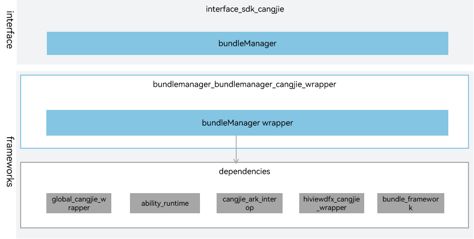

# **bundlemanager_cangjie_wrapper**

## Introduction

The Cangjie API is a Cangjie API encapsulated on OpenHarmony based on the capabilities of the Bundle Management subsystem. The Bundle Management subsystem allows you to query bundle information. The currently bundle manager Cangjie api only supports standard devices.

## System Architecture

**Figure 1** System architecture of bundlemanager_cangjie_wrapper



As shown in the architecture:

interface: Provides APIs for developers.

- BundleManager: Obtains the bundle information. Obtains the JSON string array of the current application's configuration. Checks whether a link can be opened.
- ElementName: Definition of ElementName. Includes device ID, application Bundle name, and other information.
- Metadata: Definition of Metadata. Includes metadata name, metadata value, and metadata resources.
- Skill: Skill object. Includes the collection of actions, entities, uris, and domainVerify that Skill receives.

frameworks:

- BundleManager wrapper: Encapsulates the Cangjie application information query capability. The Cangjie application information query capability is implemented through the BundleManager class.
- ElementName wrapper: Provides the definition of the Cangjie ElementName class.
- Metadata wrapper: Provides the definition of the Cangjie Metadata class.
- Skill wrapper: Provides the definition of the Cangjie Skill class.

Dependency Component Introduction in Architecture:

- bundle_framework: It is responsible for providing basic functions of bundlemanager, and encapsulates C interfaces to provide interoperability for Cangjie.
- ability_runtime: Encapsulates the C language definition of ElementName to provide interoperability with Cangjie.
- cangjie_ark_interop: Responsible for providing APILevel definitions, used for annotating APIs. Also provides the BusinessException exception class definition that is thrown to users.
- hiviewdfx_cangjie_wrapper: Responsible for providing HiLog APIs, used for printing logs at critical paths.
- global_cangjie_wrapper: Provides the capability to access application resources. The ApplicationInfo depends on AppResource from this module.

## Directory Structure

```
foundation/bundlemanager/bundlemanager_cangjie_wrapper
├── figures                   # architecture pictures
├── ohos                      # Cangjie Bundle Management code
│   ├── bundle                # Cangjie bundle code
│   │   └── bundle_manager    # Cangjie bundle basic function implementation
│   ├── element_name          # Cangjie ElementName code
│   ├── metadata              # Cangjie Metadata code
│   └── skill                 # Cangjie Skill code
└── test                      # Cangjie test code
    └── bundle_manager        # Cangjie bundle test code
```


## Usage Guidelines

The following features are provided:

  - The module provides APIs for obtaining this application information.
  - Obtains the json string array of the current application's configuration file.
  - Checks whether a link can be opened.
  - Provides the definition of ElementName, Metadata, and Skill.


The following features are not provided yet:

  - Obtain other application information.
  - Obtaining the package name of a corresponding application based on a given uid.


For Bundlemanager-related APIs, please refer to [ohos.bundle.bundle_manager (BundleManager Management)](https://gitcode.com/openharmony-sig/arkcompiler_cangjie_ark_interop/blob/master/doc/API_Reference/source_en/apis/AbilityKit/cj-apis-bundle_manager.md).

## Constraints

The following features are not provided yet:

  - Obtain other application information.
  - Obtaining the package name of a corresponding application based on a given uid.

## Code Contribution

Developers are welcome to contribute code, documentation, etc. For specific contribution processes and methods, please refer to [Code Contribution](https://gitcode.com/openharmony/docs/blob/master/en/contribute/code-contribution.md).

## Repositories Involved

[bundlemanager_bundle_framework](https://gitcode.com/openharmony/bundlemanager_bundle_framework)

[ability_ability_runtime](https://gitcode.com/openharmony/ability_ability_runtime)

[arkcompiler_cangjie_ark_interop](https://gitcode.com/openharmony-sig/arkcompiler_cangjie_ark_interop)

[hiviewdfx_hiviewdfx_cangjie_wrapper](https://gitcode.com/openharmony-sig/hiviewdfx_hiviewdfx_cangjie_wrapper)

[global_global_cangjie_wrapper](https://gitcode.com/openharmony-sig/global_global_cangjie_wrapper)
