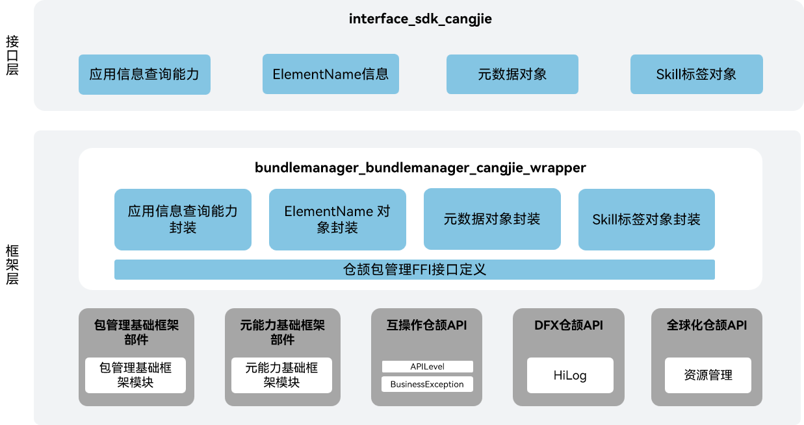

# 包管理仓颉接口

## 简介

包管理仓颉接口是在OpenHarmony上基于包管理子系统能力之上封装的仓颉API。包管理子系统负责应用安装包的管理，提供安装包的信息查询能力。当前开放的包管理仓颉接口仅支持standard设备。

## 系统架构

**图 1** 包管理仓颉架构图



如架构图所示：

- 获取当前应用包信息：提供当前应用包信息的查询能力。
- 获取自身配置文件字符串：提供UIAbility组件信息、ExtensionAbility组件信息的查询能力，返回json格式字符串。
- 查询链接是否可以打开：提供查询给定的链接是否可以打开的能力。
- 仓颉包管理FFI接口定义：负责定义C互操作仓颉接口，用于实现仓颉包管理能力。
- 包管理基础框架模块：负责提供包管理基础功能，封装C接口提供给仓颉进行互操作。

## 目录

```
foundation/bundlemanager/bundlemanager_cangjie_wrapper
├── figures               # 存放README中的架构图
└── ohos                  # 仓颉包管理接口实现
    ├── bundle            # 仓颉bundle接口实现
    ├── element_name      # 仓颉ElementName接口实现
    ├── metadata          # 仓颉Metadata接口实现
    └── skill             # 仓颉Skill接口实现
```

## 使用说明

包管理仓颉接口提供以下功能，开发者可以根据使用诉求使用：

  - 提供当前应用包信息的查询能力。
  - 提供自身相应配置文件的json格式字符串的获取能力。
  - 提供给定的链接是否可以打开的查询能力。


与ArkTS相比，暂不支持以下功能：

  - 暂不支持获取其他应用包的信息。
  - 暂不支持安装包的安装能力。
  - 暂不支持安装包的更新能力。
  - 暂不支持安装包的卸载能力。
  - 暂不支持包信息存储能力。


包管理相关API请参见[ohos.bundle.bundle_manager（bundleManager管理）](https://gitcode.com/openharmony-sig/arkcompiler_cangjie_ark_interop/blob/master/doc/API_Reference/source_zh_cn/apis/AbilityKit/cj-apis-bundle_manager.md)，相关指导请参见[程序框架服务开发指南](https://gitcode.com/openharmony-sig/arkcompiler_cangjie_ark_interop/tree/master/doc/Dev_Guide/source_zh_cn/application-models)。

## 参与贡献

欢迎广大开发者代码，文档等，具体的贡献流程和方式请参见[参与贡献](https://gitcode.com/openharmony/docs/blob/master/zh-cn/contribute/%E5%8F%82%E4%B8%8E%E8%B4%A1%E7%8C%AE.md)。

## 相关仓

[bundlemanager_bundle_framework](https://gitee.com/openharmony/bundlemanager_bundle_framework)

[arkcompiler_cangjie_ark_interop](https://gitcode.com/openharmony-sig/arkcompiler_cangjie_ark_interop)

[global_global_cangjie_wrapper](https://gitcode.com/openharmony-sig/global_global_cangjie_wrapper)

[arkui_arkui_cangjie_wrapper](https://gitcode.com/openharmony-sig/arkui_arkui_cangjie_wrapper)

[hiviewdfx_hiviewdfx_cangjie_wrapper](https://gitcode.com/openharmony-sig/hiviewdfx_hiviewdfx_cangjie_wrapper)
