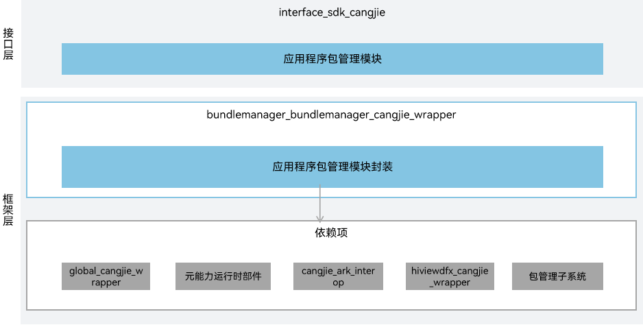

# 包管理仓颉接口

## 简介

包管理仓颉接口是在 OpenHarmony 上基于包管理子系统能力之上封装的仓颉API。包管理子系统负责应用安装包的管理，提供安装包的信息查询能力。

包管理子系统架构如下图所示：




## 目录

```
foundation/bundlemanager/bundlemanager_cangjie_wrapper
├── ohos                        # 仓颉包管理接口实现
├── figures                     # 存放readme中的架构图
```

## 约束

当前开放的包管理仓颉接口仅支持standard设备。

## 使用说明

如架构图所示，包管理仓颉接口以下功能接口，开发者可以根据使用诉求使用：

  - 包管理模块提供当前应用信息的查询能力，支持应用包信息、应用程序信息、UIAbility组件信息、ExtensionAbility组件信息等信息的查询。
  - 查询给定的链接是否可以打开。

与ArkTS相比，暂不支持以下功能：

  - 暂不支持获取其他应用包的信息。
  - 暂不支持安装包的安装能力。
  - 暂不支持安装包的更新能力。
  - 暂不支持安装包的卸载能力。
  - 暂不支持包信息存储能力。

## 相关仓

[bundlemanager_bundle_framework](https://gitee.com/openharmony/bundlemanager_bundle_framework/blob/master/README_zh.md)
